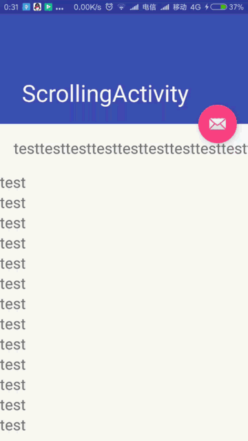
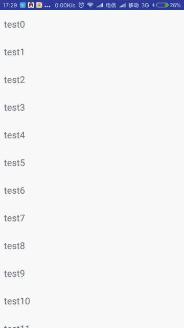
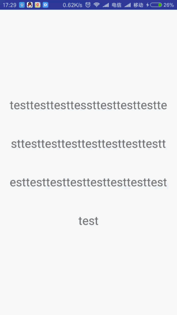
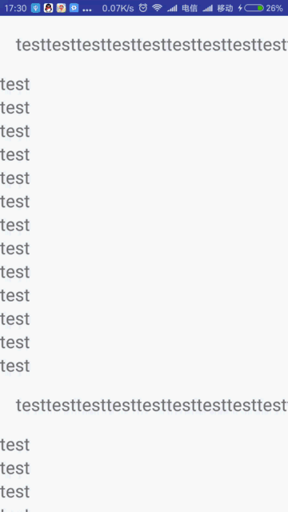
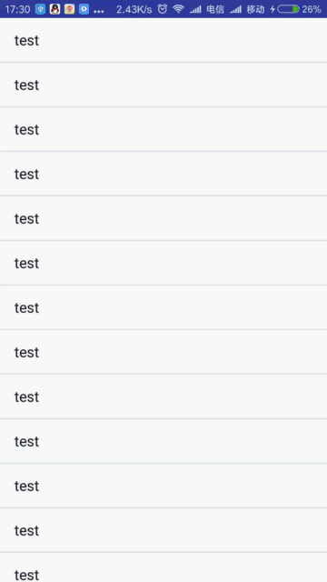
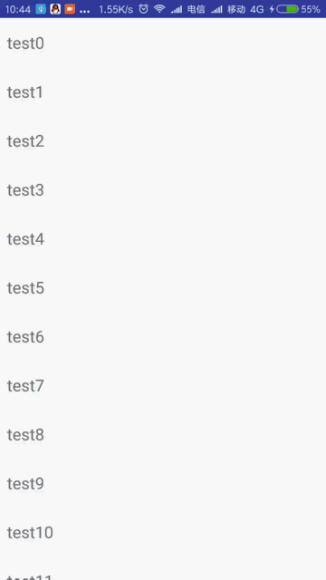
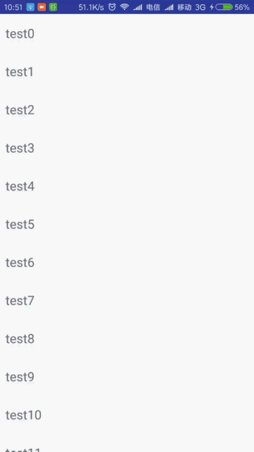

# PullRefreshLayout[  ](https://bintray.com/yan157/maven/pullrefreshlayout/_latestVersion)
#



###### 首先吐槽一下现在流行的刷新库，一个字大，包涵个人很多集成到项目中不需要的类，也很难找到很满意的效果，所以自己自己动手丰衣足食，撸一个。
## 1.概述
对所有基础控件(包括，嵌套滑动例如RecyclerView、NestedScrollView，普通的TextView、ListView、ScrollerView、LinearLayout等)提供下拉刷新、上拉加载的支持,处理了横向滑动冲突（例如:顶部banner的情况）
，且实现无痕过度。

### gradle (改用bintray-release，2017-7-8 16:00上传，以下暂时不会生效)
compile 'com.yan:pullrefreshlayout:1.1.2'

## 2.说明  
支持所有基础控件
<br/>
<br/>
#### loading 出现效果默认(STATE_FOLLOW、STATE_PLACEHOLDER_FOLLOW、STATE_CENTER、STATE_PLACEHOLDER_CENTER、STATE_FOLLOW_CENTER、STATE_CENTER_FOLLOW)




```
//-控件设置-
    refreshLayout.autoRefresh();// 自动刷新
    refreshLayout.setOverScrollDampingRatio(0.2f);//  值越大overscroll越短 default 0.2
    refreshLayout.setAdjustTwinkDuring(3);// 值越大overscroll越慢 default 3
    refreshLayout.setScrollInterpolator(interpolator);// 设置scroller的插值器
    refreshLayout.setLoadMoreEnable(true);// 上拉加载是否可用 default false
    refreshLayout.setDuringAdjustValue(10f);// 动画执行时间调节，越大动画执行越慢 default 10f
    // 刷新或加载完成后回复动画执行时间，为-1时，根据setDuringAdjustValue（）方法实现 default 300
    refreshLayout.setRefreshBackTime(300);
    refreshLayout.setDragDampingRatio(0.6f);// 阻尼系数 default 0.6
    refreshLayout.setPullFlowHeight(400);// 拖拽最大范围，为-1时拖拽范围不受限制 default -1
    refreshLayout.setRefreshEnable(false);// 下拉刷新是否可用 default false
    refreshLayout.setPullTwinkEnable(true);// 回弹是否可用 default true 
    refreshLayout.setAutoLoadingEnable(true);// 自动加载是否可用 default false
    
    // headerView和footerView需实现PullRefreshLayout.OnPullListener接口调整状态
    refreshLayout.setHeaderView(headerView);// 设置headerView
    refreshLayout.setFooterView(footerView);// 设置footerView
    
    /**
    * 设置header或者footer的的出现方式,默认7种方式
    * STATE_FOLLOW, STATE_PLACEHOLDER_FOLLOW, STATE_PLACEHOLDER_CENTER
    * , STATE_CENTER, STATE_CENTER_FOLLOW, STATE_FOLLOW_CENTER
    * ,STATE_PLACEHOLDER
    */
    refreshLayout.setRefreshShowGravity(RefreshShowHelper.STATE_CENTER,RefreshShowHelper.STATE_CENTER);
    refreshLayout.setHeaderShowGravity(RefreshShowHelper.STATE_CENTER)// header出现动画
    refreshLayout.setFooterShowGravity(RefreshShowHelper.STATE_CENTER)// footer出现动画
    // PullRefreshLayout.OnPullListener
        public interface OnPullListener {
            // 刷新或加载过程中位置相刷新或加载触发位置的百分比，时刻调用
            void onPullChange(float percent);
            void onPullReset();// 数据重置调用
            void onPullHoldTrigger();// 拖拽超过触发位置调用
            void onPullHoldUnTrigger();// 拖拽回到触发位置之前调用
            void onPullHolding(); // 正在刷新
            void onPullFinish();// 刷新完成
        }
```
## 3.demo用到的库
 loading 动画
 <br/>
 AVLoadingIndicatorView(https://github.com/81813780/AVLoadingIndicatorView)