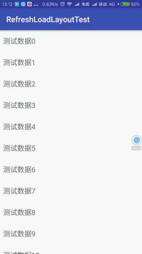

# BSRGift
#


## 1.概述
纯嵌套滑动实现无痕过度上拉加载、下拉刷新

## 2.说明  
该控件作用于，实现了NestedScrollingChild的控件（recycleView、NestedScrollView）
,其他控件需要实现NestedScrollingChild可参考（PullListView、PullScrollView）

```
//-控件设置-
    refreshLayout.setLoadMoreEnable(true);// 上拉加载是否可用
    refreshLayout.setDuringAdjustValue(0.4f);// 动画执行时间调节，越大动画执行越快
    // 刷新或加载完成后回复动画执行时间，为0是，根据setDuringAdjustValue（0.4f）方法实现
    refreshLayout.setRefreshBackTime(300);
    refreshLayout.setPullViewHeight(100);// 设置头部和底部的高度
    refreshLayout.setDragDampingRatio(0.6f);// 阻尼系数
    refreshLayout.setPullFlowHeight(400);// 拖拽最大范围
    refreshLayout.setRefreshEnable(false);// 下拉刷新是否可用
    refreshLayout.setUseAsTwinkLayout(true);// 剔除刷新或加载效果，保留回弹动画
```
